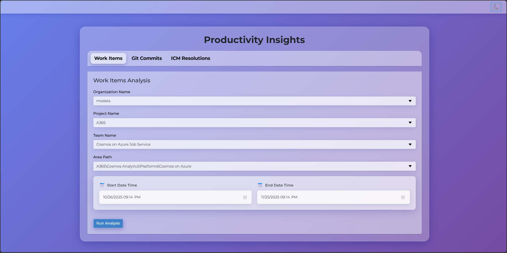
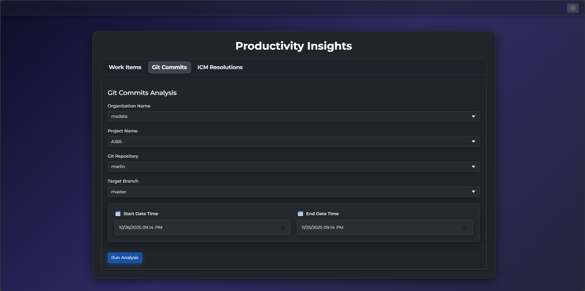

# Productivity Insights

A comprehensive Blazor-based web application for analyzing team productivity metrics from Azure DevOps and ICM (Incident Management). This tool provides detailed insights into work item completion, git commit activity, and incident resolution patterns.




## Features

### 📊 Work Items Analysis
- Track completed work items by team and assignee
- View work item completion statistics and trends
- Analyze time spent in active work states (Committed, Active, In Progress)
- Calculate time-to-complete metrics
- Detailed work item history with state transitions

### 🔄 Git Commits Analysis
- Track code contributions by author/committer
- View commit statistics with line-level changes (+additions/-deletions)
- Analyze per-file changes with detailed diff information
- Support for multiple repositories and branches
- Distinguish between added, edited, and deleted files

### 🚨 ICM Resolutions Analysis
- Monitor incident resolution and mitigation metrics
- Track time-to-resolve (TTR) and time-to-mitigate (TTM)
- Analyze incidents by severity and status
- View active and created incidents by owner
- Detailed incident history with resolution information

## Technology Stack

- **Framework**: .NET 8.0
- **UI**: Blazor Server with Interactive Rendering
- **Styling**: Bootstrap 5
- **Authentication**: Azure Identity with Interactive Browser Credential
- **APIs**: 
  - Azure DevOps REST API (v7.0)
  - ICM REST API
- **Security**: Azure Key Vault for certificate management

## Prerequisites

- .NET 8.0 SDK or later
- Azure DevOps account with appropriate permissions
- Azure subscription with Key Vault access (for ICM analysis)
- Valid Azure AD credentials

## Installation

1. Clone the repository:
```bash
git clone <repository-url>
cd ProductivityInsights
```

2. Restore dependencies:
```bash
dotnet restore
```

3. Update configuration in `appsettings.json` if needed

4. Build the project:
```bash
dotnet build
```

## Running the Application

### Development Mode
```bash
dotnet run
```

The application will start on `https://localhost:<port>` (check console output for the exact URL).

### Production Mode
```bash
dotnet run --configuration Release
```

## Configuration

### Azure DevOps Settings
The application connects to Azure DevOps organizations and projects. Configure available options in `AnalysisOptions.razor`:

- **Organizations**: msdata, powerbi
- **Projects**: A365, HDInsight, MWC
- **Teams**: Cosmos on Azure Job Service, FastSpark, JS Reliability, etc.

### ICM Settings
For incident analysis, configure:
- **Key Vault URL**: Azure Key Vault endpoint
- **Certificate Name**: Certificate for ICM authentication
- **Owning Teams**: Team paths in ICM

### Authentication
The application uses Azure Interactive Browser Credential for authentication. On first run:
1. A browser window will open for Azure AD sign-in
2. Sign in with your Microsoft credentials
3. Grant necessary permissions for Azure DevOps and Key Vault access

## Usage

### Analyzing Work Items
1. Navigate to the **Work Items** tab
2. Select organization, project, and team
3. Choose the area path
4. Set start and end date range
5. Click **Run Analysis**
6. View summary statistics and expand rows for detailed information

### Analyzing Git Commits
1. Navigate to the **Git Commits** tab
2. Select organization, project, and repository
3. Choose target branch (main/master)
4. Set date range
5. Click **Run Analysis**
6. View commit statistics with line changes per contributor
7. Expand rows to see individual commits with file-level details

### Analyzing ICM Incidents
1. Navigate to the **ICM Resolutions** tab
2. Select owning team
3. Configure Key Vault settings
4. Set date range
5. Click **Run Analysis**
6. View incident resolution metrics including TTR and TTM
7. Expand rows for detailed incident information

## Project Structure

```
ProductivityInsights/
├── Components/
│   ├── Layout/           # Layout components (MainLayout, NavMenu)
│   └── Pages/            # Razor pages (AnalysisOptions, Home, etc.)
├── Metrics/              # Business logic for metrics calculation
│   ├── GitCommitMetrics.cs
│   ├── IncidentAttendanceMetrics.cs
│   └── WorkItemCompletionMetrics.cs
├── Models/               # Data models and DTOs
│   ├── CommitCollection.cs
│   ├── IncidentCollection.cs
│   ├── WorkItemDetailsCollection.cs
│   └── ...
├── Options/              # Query options classes
│   ├── CommitQueryOptions.cs
│   ├── IncidentQueryOptions.cs
│   └── WorkItemQueryOptions.cs
├── Services/             # Application services
│   └── ThemeService.cs
├── Utilities/            # Helper utilities
│   ├── FormatUtilities.cs
│   ├── KeyVaultUtilities.cs
│   ├── PrintUtilities.cs
│   └── UserToken.cs
├── wwwroot/              # Static files (CSS, JS)
├── Program.cs            # Application entry point
└── appsettings.json      # Configuration
```

## Key Features Implementation

### Caching
Analysis results are cached per tab to improve performance when switching between tabs. Results are refreshed when running a new analysis.

### Interactive UI
- Expandable rows for detailed information
- Loading indicators during API calls
- Modal confirmations for analysis parameters
- Responsive design with Bootstrap

### Error Handling
- Graceful handling of API failures
- Warning messages for missing data
- Debug logging in development mode

## API Integration

### Azure DevOps REST API
The application uses the following endpoints:
- Commits: `/git/repositories/{repo}/commits`
- Commit Details: `/git/repositories/{repo}/commits/{id}`
- Commit Changes: `/git/repositories/{repo}/commits/{id}/changes`
- Work Items: `/wit/wiql` and `/wit/workitems`
- File Diffs: `/_versioncontrol/fileDiff`

### ICM REST API
- Search incidents by status and date range
- Retrieve incident details including resolution/mitigation data
- Certificate-based authentication via Azure Key Vault

## Performance Considerations

- **Pagination**: Handles large datasets with continuation tokens
- **Rate Limiting**: Includes delays between API calls to avoid throttling
- **Async Operations**: All API calls are asynchronous
- **Parallel Processing**: Results are loaded in background tasks

## Troubleshooting

### Authentication Issues
- Ensure you have appropriate permissions in Azure DevOps
- Check Azure AD credentials and consent
- Verify Key Vault access for ICM analysis

### API Errors
- Check network connectivity
- Verify organization/project names are correct
- Ensure date ranges are valid
- Review console output for detailed error messages

### Performance Issues
- Reduce date range for faster results
- Check for rate limiting errors in console
- Consider analyzing smaller teams/repositories

## Development

### Debug Mode
Debug mode provides additional logging:
```csharp
#if DEBUG
    Console.WriteLine("Debug information...");
#endif
```

### Adding New Metrics
1. Create a new metrics class in `Metrics/`
2. Add corresponding models in `Models/`
3. Update `AnalysisOptions.razor` with new UI tab
4. Implement rendering methods for results display

## Contributing

When contributing to this project:
1. Follow existing code structure and naming conventions
2. Include XML documentation for public methods
3. Test with multiple organizations and date ranges
4. Update README for new features

## License

[Specify your license here]

## Support

For issues or questions:
- Check console output for error details
- Review Azure DevOps API documentation
- Verify authentication and permissions

## Version History

- **Current**: Initial release with work items, git commits, and ICM analysis

---

**Note**: This application requires appropriate permissions and credentials for Azure DevOps and ICM access. Ensure you have the necessary access before running analyses.
